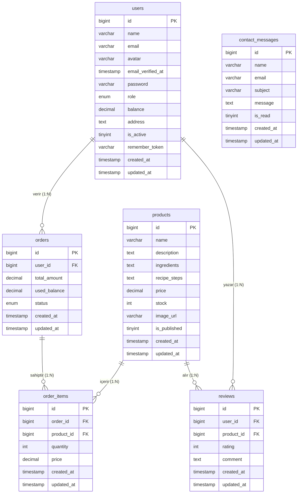
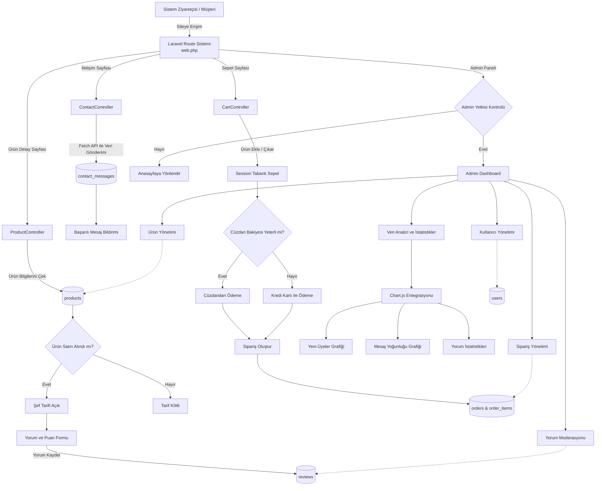

# Tarif Paketi - Hazır Tarif Paketi ve E-Ticaret Platformu

Tarif Paketi, modern tüketicilerin hızlı, pratik ve israfı önleyen mutfak çözümleri arayışına yanıt veren dinamik bir e-ticaret platformudur. Proje; sadece statik bir yemek tarifi blogu olmanın ötesinde; tam ölçülü gıda malzemelerinin ve özel şef tariflerinin kullanıcılara ulaştırılmasını sağlayan dinamik bir sepet, sipariş, cüzdan ve gelişmiş bir içerik yönetim (Admin) sistemi barındırır.

---

## Proje Özellikleri

###  Kullanıcı (Müşteri) Modülü
- **Gelişmiş Ana Sayfa:** Dinamik slayt geçişleri, popüler tarif kutuları entegrasyonu ve müşteri yorumları.
- **Kilitli İçerik Mekanizması:** Yemek tariflerinin detaylı yapılış adımları ve özel şef tüyoları sadece ürünü satın alan onaylı müşterilere gösterilir.
- **Dinamik Sepet ve Sipariş Takibi:** Kullanıcıların sepet verileri ve cüzdan bakiyeleri oturumlar üzerinden güvenli şekilde işlenir; geçmiş siparişler kronolojik olarak listelenir.
- **Cüzdan Tabanlı Ödeme:** Kullanıcılar cüzdan bakiyeleri üzerinden sipariş işlemlerini gerçekleştirir.
- **Asenkron İletişim ve Harici API'ler:** İletişim formunda `Fetch API` ile sayfa yenilenmeden mesaj gönderimi, canlı `Google Maps` haritası ve `OpenWeatherMap API` entegrasyonu ile anlık hava durumu gösterimi.
- **Profil ve Hesap Yönetimi:** Bilgi güncelleme, profil fotoğrafı yükleme ve hesap dondurma işlemleri.

### Yönetici (Admin) Paneli
- **Dashboard ve Veri Analitiği:** `Chart.js` grafik motoru ile son 7 günün yeni üye kayıtları, mesaj yoğunlukları ve yorum istatistikleri görsel olarak raporlanır.
- **Sipariş Yönetimi:** Tek tıkla sipariş durumunu ilerletme (*Bekliyor -> Onaylandı -> Tedarik Ediliyor -> Kutulanıyor -> Kargoya Verildi -> Teslim Edildi*).
- **Ürün ve Stok Yönetimi:** Formlar üzerinden yeni tarif paketi ekleme, düzenleme, sunucuya görsel yükleme ve kalıcı olarak ürün silme.
- **Kullanıcı Yönetimi:** Tüm kullanıcıların bakiye ve yetkilerini görüntüleme, tek tıkla kullanıcıyı "Dondurulmuş" statüsüne alma veya silme.
- **Gelen Mesajlar:** Ziyaretçilerden gelen mesajları kronolojik listeleme ve silme (mesaj göndermek için üye olma şartı aranmaz).

---

## Kullanılan Teknolojiler ve Mimari

### Backend (Sunucu Tarafı)
- **Dil:** PHP 8.2 (Tip güvenliği ve yüksek performans)
- **Framework:** Laravel 11.x (Model-View-Controller - MVC Mimarisi)
- **Veritabanı:** MySQL (Veri tutarlılığı ve ilişkisel modelleme)
- **ORM:** Eloquent ORM
- **Güvenlik:** Laravel Middleware (Rol tabanlı yetkilendirme) ve Bcrypt Hash algoritması ile şifre güvenliği.

### Frontend (Kullanıcı Arayüzü)
- **Şablon Motoru:** Laravel Blade (Modüler ve tekrar kullanılabilir yapılar)
- **Stil ve Tasarım:** HTML5, CSS3, SCSS ve Bootstrap Framework (Mobil Uyumlu / Responsive grid sistemi)
- **Asenkron Yapı:** JavaScript (Fetch API) & jQuery
- **Grafik Motoru:** Chart.js

### Geliştirme ve Canlı Ortam (DevOps)
- **Lokal Ortam:** XAMPP (Apache, PHP, MySQL) & phpMyAdmin
- **Canlı Ortam (Deployment):** Railway Platform (GitHub entegrasyonu ve `.env` ortam değişkenleri yönetimi)

---

##  Veritabanı Mimarisi

Sistem, veri tekrarını önlemek ve veri bütünlüğünü (data integrity) en üst düzeyde tutmak amacıyla ilişkisel veritabanı kurallarına ve normalizasyon süreçlerine uygun olarak tasarlanmıştır:

- **`users`:** Müşteri ve yöneticilerin temel bilgilerini, profil avatarlarını ve rol (`admin`/`user`) durumlarını tutar.
- **`products`:** Satışa sunulan tarif paketlerinin içerik, fiyat, görsel ve stok detaylarını barındırır.
- **`orders`:** Kullanıcıların sepet onayından sonra oluşan ana sipariş ve anlık durum verisidir.
- **`order_items`:** Sipariş ara tablosudur. Satın alınan ürünlerin adet ve **o anki satış fiyatı** bilgisini saklar. Fiyatın burada tutulması, ürün fiyatı gelecekte değişse bile geçmiş faturaların yapısının bozulmamasını sağlar.
- **`reviews`:** Sadece ürünü teslim almış onaylı müşterilerin bıraktığı 1-5 arası yıldız puanı ve metinsel yorumları tutar.
- **`contact_messages`:** Üye olma şartı aranmaksızın tüm ziyaretçilerin gönderdiği iletişim formu verilerini tutan **bağımsız varlıktır**. Ziyaretçilerin sisteme üye olmadan da ulaşabilmesi amacıyla başka hiçbir tabloyla ilişkilendirilmemiştir.

## Veritabanı Varlık-İlişki Diyagramı

---

## Çekirdek Algoritmalar (Sözde Kod)

### 1. Onaylı Kullanıcı Yorum Kontrol Mekanizması
Kullanıcıların tarif paketlerine yorum yapabilmesi için hem oturum açmış olması hem de ilgili ürünü gerçekten satın alıp teslim almış olması gerekir:

```text
ALGORİTMA OnayliKullaniciYorumKontrolu(Kullanici, Urun, YeniYorum, YeniPuan)
    // 1. Aşama: Oturum Kontrolü
    EĞER Kullanici.OturumAcmisMi() EŞİTTİR Yanlış İSE
        "Yorum yapabilmek için lütfen önce giriş yapınız." uyarısını göster
        Giriş Sayfasına yönlendir ve Süreci Sonlandır()
    BİTTİ

    // 2. Aşama: Satın Alma Geçmişi Sorgusu
    SatinAlmaGecmisi = Veritabani_Sorgula(orders TABLOSU user_id VE order_items TABLOSU product_id WHERE status = 'teslim_edildi')
    EĞER SatinAlmaGecmisi EŞİTTİR Boş İSE
        YorumFormunuGizle()
        "Sadece bu yemek paketi kutusunu satın almış olan kullanıcılar yorum yapabilir." uyarısını bas
        SüreçSonlandır()
    DEĞİLSE
        YorumFormunuAktifEt()
    BİTTİ

    // 3. Aşama: Veri Validasyonu ve Kayıt
    EĞER Form_TetiklendiMi() EŞİTTİR Doğru İSE
        EĞER YeniYorum Boş İSE VEYA YeniPuan < 1 VEYA YeniPuan > 5 İSE
            "Lütfen geçerli bir yorum ve puan giriniz." uyarısını ver
        DEĞİLSE
            Veritabanina_Kaydet(reviews TABLOSU: user_id, product_id, rating, comment)
            "Yorumunuz başarıyla gönderildi." mesajını göster
        BİTTİ
    BİTTİ
SON ALGORİTMA
```

### 2. Admin Paneli Erişim ve Rol Doğrulama (Middleware)
Yönetim paneli rotalarının güvenliği veritabanındaki role alanı üzerinden katı bir şekilde kontrol edilir:
```text
ALGORİTMA AdminPanelErisimKontrolu(Istek, Kullanici)
    // 1. Oturum Kontrolü
    EĞER Kullanici.OturumAcmisMi() = FALSE İSE
        KullaniciyiYonlendir("/login")
        SONLANDIR
    BİTTİ

    // 2. Rol Doğrulama
    EĞER Kullanici.role = "admin" İSE
        Istek.IzinVer() // Rota erişimine izin ver
    DEĞİLSE
        KullaniciyiYonlendir("/home") // Yetkisiz kullanıcıyı ana sayfaya gönder
    BİTTİ
SON ALGORİTMA
```
##  Web Sitesi Sayfaları
Sistem **Kullanıcı Arayüzü** ve **Yönetici Paneli** olmak üzere iki ana bölümden oluşmaktadır.

### 1. Kullanıcı (Müşteri) Arayüzü

#### 1.1. Ana Sayfa
Sistemin giriş sayfasıdır. Kullanıcılar: Slayt gösterileri, platformun vizyonunu anlatan tanıtım içerikleri, popüler tarif kutuları ve kullanıcı yorumları ile karşılanır.

---

#### 1.2. Tarif Paketi Detay Sayfası
Kullanıcılar:
- Ürün adı, fiyat ve stok bilgilerini görebilir
- Kısa açıklamayı inceleyebilir
- Yorumları görüntüleyebilir

Sadece ürünü satın alan doğrulanmış kullanıcılar:
- 1–5 arası yıldız puanı verebilir
- Metinsel yorum bırakabilir

---

#### 1.3. İletişim Sayfası
Ziyaretçilerin yönetim ile iletişim kurduğu sayfadır.Google Maps entegrasyonu, OpenWeatherMap API ile canlı hava durumu bilgisi ve JavaScript Fetch API ile sayfa yenilenmeden form gönderimi içerir.

---

#### 1.4. Profil Sayfası
Kullanıcıların kişisel bilgilerini yönetebildiği alandır.

Kullanıcılar:
- Ad, soyad, e-posta ve adres bilgilerini güncelleyebilir
- Profil fotoğrafı yükleyebilir
- Şifre değiştirebilir
- Hesabını dondurabilir

---

#### 1.5. Siparişlerim Sayfası
Kullanıcının geçmiş siparişlerini görüntülediği sayfadır.

Her sipariş için:
- Sipariş numarası
- Toplam tutar
- Sipariş tarihi
- Sipariş durumu bilgileri listelenir.

---

### 2. Yönetici Paneli

Yönetici paneline erişim **Laravel Middleware** yapısı ile korunmaktadır. Kullanıcı yetkisi veritabanındaki `role` alanı üzerinden kontrol edilir.

---

#### 2.1. Yönetici Dashboard
Sistemin genel durumunu gösteren kontrol panelidir.Toplam sipariş sayısı, toplam kullanıcı sayısı, toplam ürün sayısı ve gelen mesaj sayısı kartlar aracılığıyla gösterilir.

Ayrıca Chart.js ile grafiksel veri görselleştirilerek son 7 güne ait istatistikler sunulur.

---

#### 2.2. Sipariş Yönetimi
Tüm müşteri siparişlerinin yönetildiği bölümdür. Sipariş durumu tek tıkla sırasıyla güncellenebilir: Bekliyor → Onaylandı → Hazırlanıyor → Paketleniyor → Kargoya Verildi → Teslim Edildi

---

#### 2.3. Ürün Yönetimi
Tarif kutularının yönetildiği paneldir. Yönetici:
- Yeni ürün ekleyebilir
- Ürünleri düzenleyebilir
- Ürünleri silebilir

---

#### 2.4. Kullanıcı Yönetimi
Sistem kullanıcılarının kontrol edildiği bölümdür. Yönetici:
- Kullanıcıları görüntüleyebilir
- Kullanıcıları pasif (dondurulmuş) hale getirebilir
- Kullanıcıları silebilir

---

#### 2.5. Gelen Mesajlar Sayfası
İletişim formundan gelen tüm mesajların görüntülendiği alandır. Mesajlar kronolojik olarak listelenir. Yönetici tarafından incelenip silinebilir
 
---
## Proje Akış Diyagramı

## Canlı Gösterim
Projenin canlı gösterimi: [Tarif Paketi](https://tarif-paketi-production.up.railway.app/)

Link olarak: https://tarif-paketi-production.up.railway.app/

---

## Geliştirici
- 231307064 Gülnihal Eruslu
